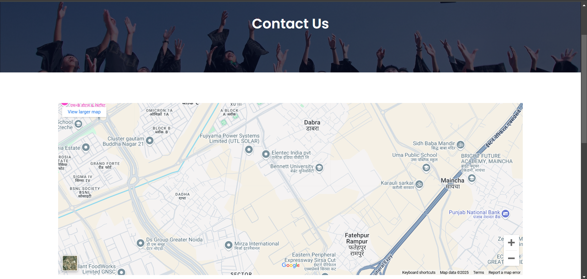
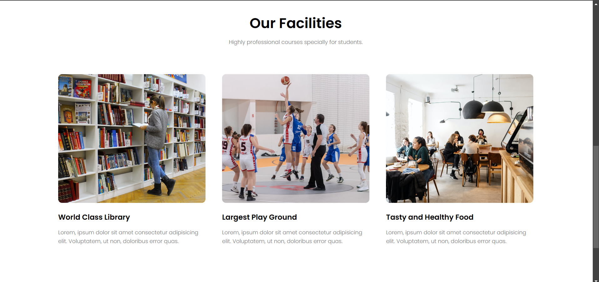
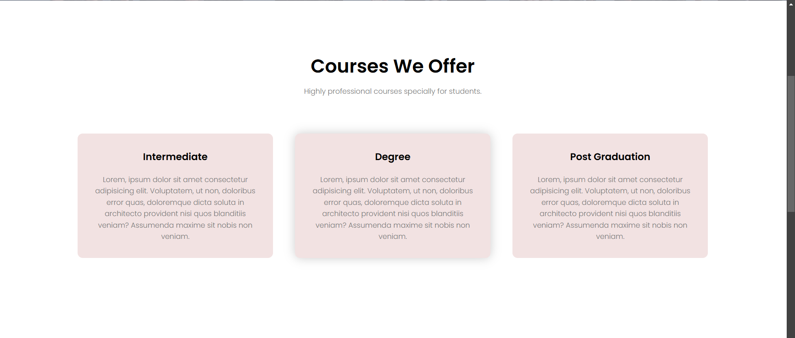
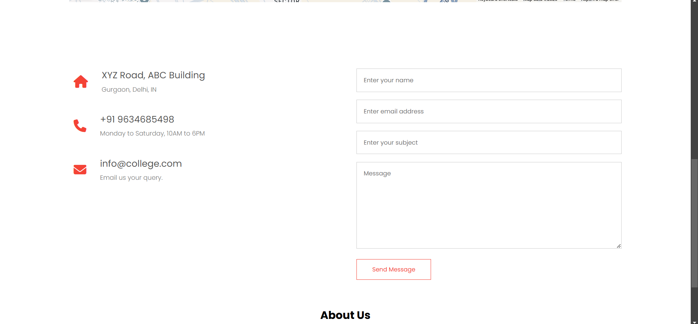
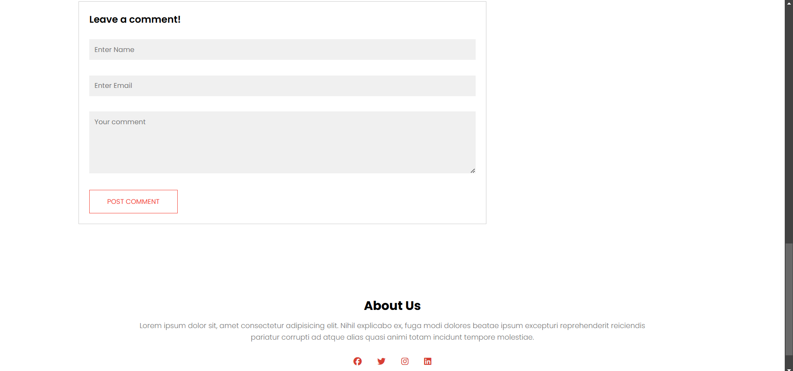

# This is a University Website

# University Website

This is a simple university website created using HTML and CSS. The project includes multiple pages to provide information about the university, its courses, and contact details.

## Features
- Responsive design for various screen sizes
- Home page with an overview of the university
- Contact page with a form and university details
- Blog page with articles and updates
- Courses page showcasing available programs
- About Us page with information about the university

## Technologies Used
- **HTML5**: For structuring the web pages
- **CSS3**: For styling and layout

## How to Use
1. Clone this repository to your local machine:
   ```bash
   git clone https://github.com/yourusername/university-website.git
   ```
2. Navigate to the project folder:
   ```bash
   cd university-website
   ```
3. Open `index.html` in your web browser to view the website.

## Project Structure
```
university-website/
├── index.html       # Home Page
├── contact.html     # Contact Page
├── blog.html        # Blog Page
├── course.html     # Courses Page
├── about.html       # About Us Page
├── styles/          # Folder containing CSS files
│   └── style.css    # Main stylesheet
└── assets/
     └──homepage.png
└──contactuspage.png
└──aboutuspage.png
└──facilitiespage.png
└──blogpage.png
└──coursespage.png
└──addresspage.png
└──commentpage.png       # Folder for images and other assets (if any)
```

## Screenshots








*Screenshot of the university website homepage.*

## Contributing
Contributions are welcome! If you'd like to enhance this project, feel free to:
- Fork the repository
- Create a new branch for your feature or fix
- Submit a pull request

## License
This project is open source and available under the [MIT License](LICENSE).

---

*This project is for educational purposes only and is not affiliated with any real university.*
